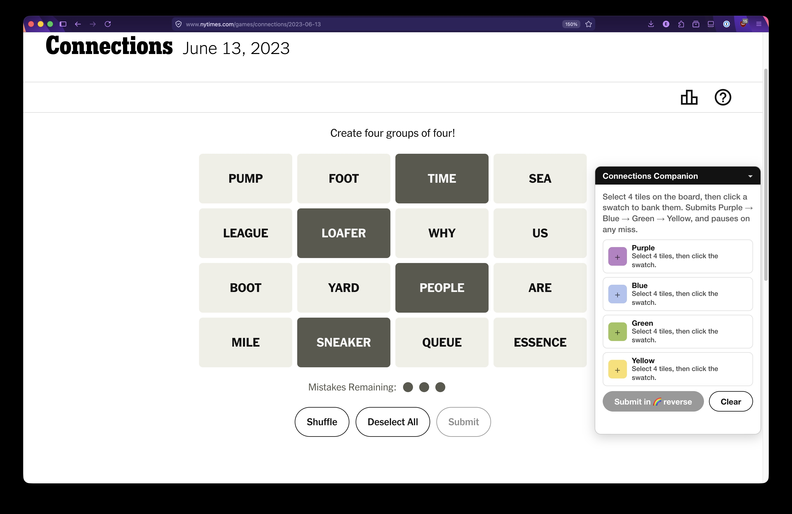

# Connections Companion

A browser extension (Firefox, Chrome, Safari) for NYT Connections that helps
you earn the **reverse rainbow badge**: plan all four groups up front, assign
each one a color, then submit them all at once in Purple → Blue → Green →
Yellow order. If any submission is wrong, the run stops immediately — the bad
group is marked red and no further guesses are spent until you fix it and
submit again.



## Install from a release (no build needed)

Grab the latest signed Firefox `.xpi` or Chromium `.zip` from
[Releases](https://github.com/jamescary/connections-companion/releases) —
install instructions are in each release's notes.

## Build (Firefox + Chromium packages)

```sh
node build.js
```

This produces `dist/firefox/` and `dist/chromium/` (plus a zip of each). The
only difference is the manifest: Firefox requires `browser_specific_settings`
for MV3, which Chrome rejects.

## Install — Chrome / Edge / Brave

1. Run `node build.js`.
2. Go to `chrome://extensions`, enable **Developer mode** (top right).
3. Click **Load unpacked** and pick the `dist/chromium` folder.

Unpacked extensions persist across restarts (Chrome just shows a developer-
mode notice on launch).

## Install — Firefox (temporary add-on)

1. Open Firefox and go to `about:debugging#/runtime/this-firefox`.
2. Click **Load Temporary Add-on…** and pick `manifest.json` in this folder.
3. Open <https://www.nytimes.com/games/connections> and click Play. The
   Companion panel appears in the bottom-right corner. Drag it by its header
   to move it anywhere (handy at high zoom where it can cover the board);
   click the header to collapse it to just the title bar. Position and
   collapsed state are remembered.

Temporary add-ons unload when Firefox restarts. For a permanent install, zip
the folder and sign it via [addons.mozilla.org](https://addons.mozilla.org)
(unlisted self-distribution works fine).

## How to use

1. Select 4 tiles on the board like normal, then click a color swatch in the
   panel to bank them as your guess for that color. Banked tiles get a colored
   outline; repeat for all four colors.
2. Click **Submit in 🌈 reverse**. The extension deselects, selects each banked
   group, and submits — Purple first, then Blue, Green, Yellow — waiting for
   the game to confirm each result before continuing.
3. **On a correct group** it moves on. If a group solves but was actually a
   different color than you guessed, the panel notes that the reverse-rainbow
   order is broken.
4. **On a wrong group** it stops instantly. The offending tiles pulse red, the
   panel shows the game's feedback ("One away…") and your remaining mistakes.
   Click ✕ on the red row (and any other rows you want to rework), re-bank,
   and submit again — already-solved groups are skipped.

You can also submit partial plans (fewer than four groups); the panel submits
whatever is banked, in reverse-rainbow order.

## How it works

- The game ignores plain synthetic `.click()`, so the extension drives tiles
  and buttons with a full `pointerdown → mousedown → pointerup → mouseup →
  click` event sequence.
- Selection state is read from the `selected` class on
  `[data-testid="card-label"]` elements (the hidden checkboxes drift out of
  sync with the game's React state).
- Submission results are detected from the DOM: a new
  `[data-testid="solved-category-container"]` (its `data-level` gives the true
  color: 0 yellow … 3 purple) means correct; a disappearing
  `[data-testid="mistake-bubble"]` means wrong.

Selectors were verified against the live game in July 2026. If NYT changes
their `data-testid` attributes, update the `SEL` map at the top of
`content.js`.
